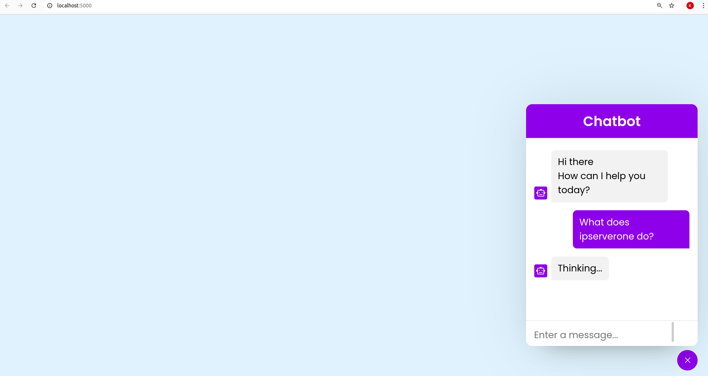
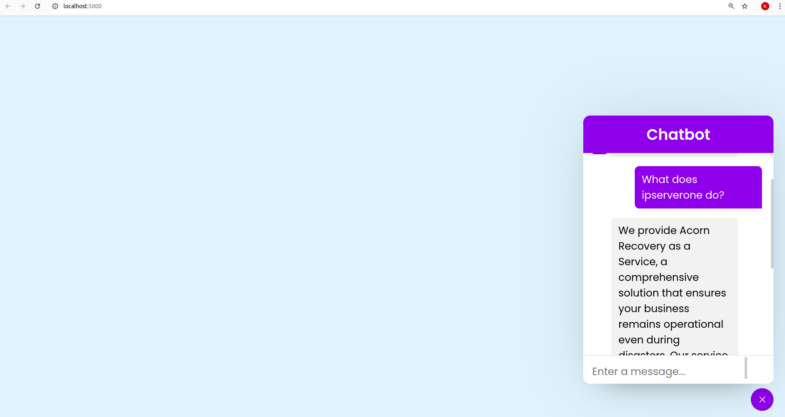

Chatbot with RAG

Use your own LLM 

Use the your own api key for Pinecone

To Run
1. docker build -t chatbot-app .
2. docker run -d -p 5000:5000 --name chatbot-container chatbot-app
3. Visit http://localhost:5000 in your browser to access the chatbot UI

